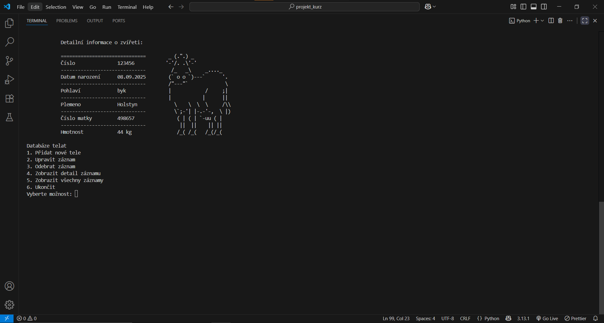
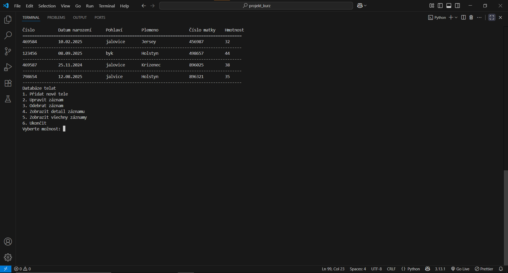
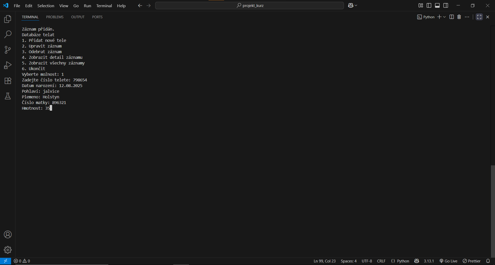

***Databáze telat***

Jednoduchá konzolová aplikace v Pythonu sloužící jako databáze telat. 

Funkce:
- Přidání nového telete
- Úprava existujícího záznamu
- Smazání zvířete z databáze
- Zobrazení všech zvířat 
- Detailní zobrazení s obrázkem ASCII kravičkou
- Automatické ukládání dat do `telata.csv`, soubor se sám vytvoří

Ukázka:
Vypsání detailu zvířete

Vypsání všech zvířat

Přidat zvíře

